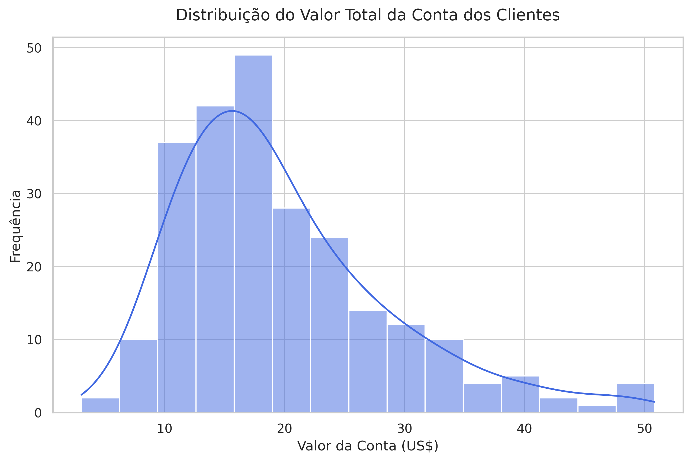
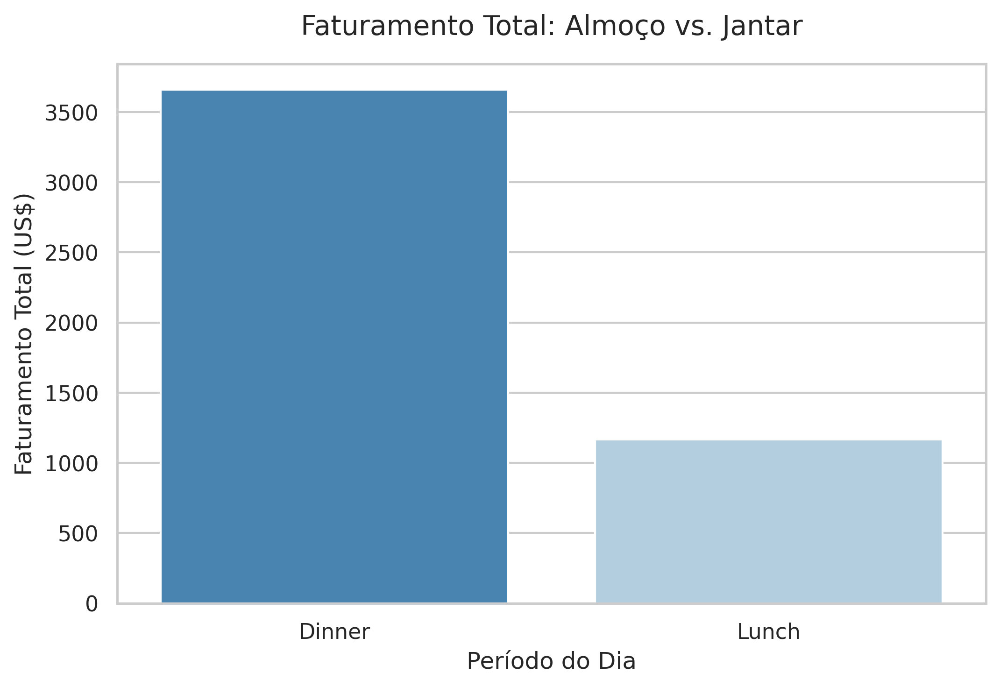
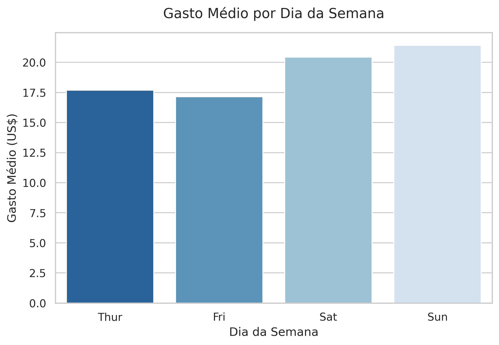
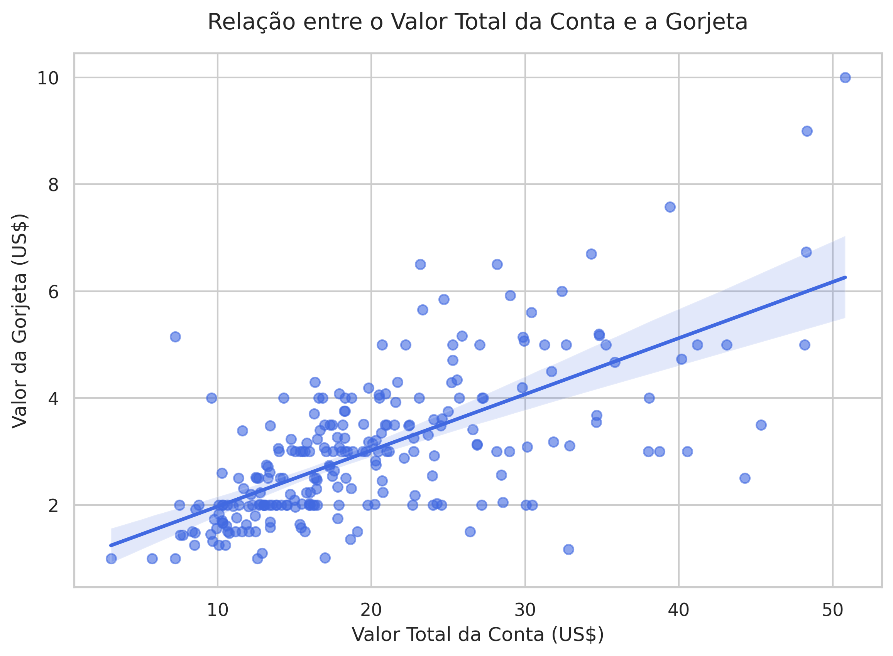

# 📊 Delivery User Behavior & Revenue Analysis

This project analyzes customer consumption habits and tipping patterns in the food delivery sector to identify growth opportunities, optimize operational revenue, and maximize the average ticket.

## 🎯 Project Objectives
- Understand temporal sales distribution and the most profitable periods.
- Evaluate the direct impact of group sizes on overall spending.
- Analyze customer tipping behaviors and their correlation with total bill value.
- Provide strategic marketing and operational recommendations based on the data.

## 🛠️ Technologies & Tools
- **Language:** Python
- **Libraries:** Pandas, NumPy, Matplotlib, Seaborn
- **Environment:** Google Colab

## 📈 Analysis & Key Insights (Including Charts)

### 1. Distribution of Total Bill Value
We analyzed how much customers typically spend on their delivery orders.

* **Business Insight:** Most orders are concentrated in a specific spending range. This insight helps determine optimal pricing strategies and minimum order thresholds for free delivery.

---

### 2. Revenue Evolution by Dining Period
We mapped the platform's revenue generation across different times of the day (e.g., Lunch vs. Dinner).

* **Business Insight:** **Dinner** stands out as the most profitable period. To capitalize on this peak demand, it is highly recommended to concentrate push notifications and targeted promotional offers during the late afternoon.

---

### 3. Impact of Party Size on the Average Ticket
We evaluated how the number of people in an order changes the final bill value.

* **Business Insight:** Larger parties directly correlate with higher spending. Introducing "Family Size" combo options on the menu is a major opportunity to further increase the platform's average ticket.

---

### 4. Tipping Analysis
An investigation into tipping habits to understand customer generosity and satisfaction.

* **Business Insight:** Understanding tipping patterns allows for better engagement strategies, such as suggesting default tip percentages at checkout to reward drivers and improve retention.

## 🔮 Next Steps
- Implement customer segmentation clusters (e.g., occasional vs. heavy users).
- Conduct A/B testing on promotional campaigns to boost weekday demand.

## ✍️ Autoria e Contato

Desenvolvido por **Renata Alves**. Se você tiver alguma dúvida, sugestão ou quiser conversar sobre este projeto, sinta-se à vontade para entrar em contato:

